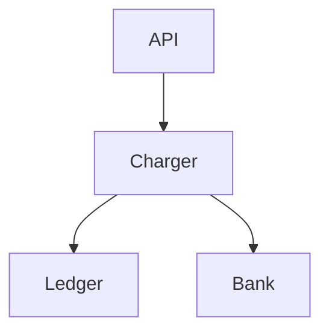

# Payment Service Design

## Overview

The payment service charges customers and reconciles ledger entries. This
document captures the architecture, data model, risks and open questions.

## Architecture



The API layer validates requests, the Charger talks to the bank, and the Ledger
records every movement.

## Data Model

| Field   | Type    | Status   |
|---------|---------|----------|
| id      | uuid    | stable   |
| amount  | decimal | stable   |
| state   | enum    | proposed |

## Configuration

```toml
[payment]
currency = "JPY"
retry_max = 3
timeout_ms = 2000
```

## API

```http
POST /v1/charges
Content-Type: application/json

{ "amount": 1200, "currency": "JPY" }
```

## Risks

Double-charging on network retry could corrupt the ledger.

Bank timeouts may leave a charge in an unknown state.

## Open Questions

Should refunds live in this service or a separate one?

Which currencies must we support at launch?

## TODO

- [x] Draft the ledger schema
- [ ] Add idempotency keys to the charge endpoint
- [ ] Load-test the bank adapter

<!-- TODO: revisit retry_max once we have bank SLA numbers -->

See the [ledger spec](https://example.com/ledger) for details.
